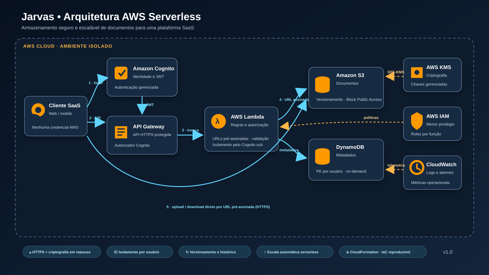

# jarvas-aws-architecture

Solução AWS serverless para armazenamento seguro e escalável de documentos em uma plataforma SaaS, combinando autenticação, isolamento entre usuários, acesso temporário, otimização de custos e preservação histórica dos arquivos.

## Arquitetura proposta

A arquitetura utiliza Amazon Cognito, API Gateway, AWS Lambda, Amazon S3, DynamoDB, IAM, AWS KMS e CloudWatch. Toda a infraestrutura será reproduzível por AWS CloudFormation.

- [Documentação da arquitetura e dos fluxos](docs/architecture.md)
- [Fonte editável do diagrama em Mermaid](docs/architecture.mmd)

> Este repositório está em evolução. A implementação da infraestrutura como código e das funções serverless será adicionada nas próximas etapas.
